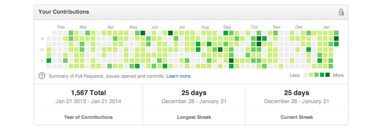

# Building your Online Presence

Your online presence is powerful. It reveals a part of who you are and helps build trust and credibility.

These days, almost everyone is on the internet - most people are on facebook and twitter some on LinkedIn and few have their own personal websites. This means that to find information about someone, all we need to do is search for them on the internet. And because we share a slice of who we are on the internet, it really shapes the perception people have about us.

So what about us we put on the internet, pretty much determines the first impression that people might have. Today, job recruiters may search for you online and opportunity applications ask you to include your LinkedIn and Github profiles, your personal blog or website too. Not having an online presence is quickly turning to be a negative signal especially if your role is expected to revolve around the internet.

Given that it is easy enough to curate what we share on the internet and what about us is published, we can surely take some efforts in ensuring we have a decent to great online presence.

Let’s look at few ways in which you can improve your online presence.

## LinkedIn Profile

LinkedIn is a social network for professionals. On LinkedIn, you can find new opportunities to grow your career and connect with professionals. You can showcase all your experiences, accomplishments and even get recommendations from people you have worked with.

Being on LinkedIn and maintaining a good profile automatically ensures that your name comes up when searched for on Google. This in turn adds credibility to your profile and talks much about your professionalism.

## Github Profile

GitHub is a code sharing and publishing service. It is a social networking site for programmers.

Generally, contributing to open source technologies will help you improve your skills and also get noticed by people and opportunities. If you are a developer, then one of the best ways in which you can showcase your work is by maintaining an active github profile. Every time you make a commit to Github, your activity gets marked as green. This gives people a quick overview about consistency of your work.

### Own website

Having your own website is one of the best ways to control your narrative. You decide what about you is communicated through your website and it helps you in shaping up what you wish for other people to know about you.

You may also use your website to share a snapshot of your Resume, your experience with projects, accomplishments and so on.

This website by Arvind Sanjeev is a good example to emulate: [http://arvindsanjeev.com](http://arvindsanjeev.com)

He appears to have used HTML and CSS to build his own website.

If you are not quite comfortable with website development using HTML and CSS, don’t worry. You have other options to quickly build your own website:

#### [**Google sites**](https://www.sites.google.com/)

Google sites is inevitably one of the easiest options at your disposal to quickly create your website. It is much like dragging and dropping elements and publishing your site on to the web.

You can build your website in just under 5 minutes without writing a single line of code.

Example website: [anitagrace.in](http://anitagrace.in), [aryamurali.com](http://aryamurali.com), [Rohan Saxena](https://sites.google.com/view/rohansaxena)

#### [**Wordpress**](https://wordpress.com/)

Wordpress has slightly more extensive options than Google sites when it comes to themes and functionalities. The ability to code on top of what you’ve built using custom themes is an added plus here.

But for a quick website, you can surely use the drag and drop features and get going.

Example website: [https://thegirlwrites.in/](https://thegirlwrites.in/)

#### [**Jekyll**](https://github.com/jekyll/jekyll)

Jekyll is a simple, blog-aware, static site generator for personal, project, or organization sites.

There are a number of Jekyll themes available and you need to be comfortable with some coding to edit out your Jekyll site. But with the ability to fork a site you liked on the internet and editing it to suit your style, jekyll themes work well in quickly adopting a website you liked.

Example website: [http://jamigibbs.com/](http://jamigibbs.com/)

Github Repo: [https://github.com/jamigibbs/portfolio](https://github.com/jamigibbs/portfolio)

## Blog

Having your blog online and writing away your thoughts, experiences and learning is a great way to build an online reputation. As a student, your focus can primarily be around the projects you do and the organisations you’ve worked with.

Writing consistently about your work ensures that it comes up on top when people search for you. An additional benefit of this is that you’ll be able to consolidate your own learning as well.

Getting started with blogging is quite easy. Just decide to write and write away. Initially when you get started with writing, it is important that you write for yourself, so that you can improve upon your written communication skills. You will eventually develop a following and people will begin to appreciate your work. But you will need to consistently keep writing before you get there.

You can quickly begin blogging by using one of the following platforms:

[**Medium**](https://medium.com/)

Medium is a brilliant writing tool. Their fonts and features are pretty neat. So you wouldn’t have to worry much about making your blog beautiful. It is very easy to write, edit and publish on medium.

Medium itself has a lot of subscribers and readers. So there’s a better chance that people will discover your blogs. Getting started is as simple as creating a profile and writing away.

[**Wordpress**](https://wordpress.com/)

If you wish to have your own blog along with your personal website, wordpress can be a good option.

[**Google Sites**](https://www.sites.google.com/)

Same goes for Google sites. You can quickly write and publish here. But unlike medium, there’s a dearth of community around google sites. So people may not naturally discover your content unless you share it or they discover it through search.

[**Blogger**](https://www.blogger.com/)

Blogger also lets you quickly create your blog and start writing. It is quite similar to wordpress in this regard.

## Learning to set up online profiles and personal website

To set up your own online profiles on LinkedIn, Github, Medium and also build your own website, you might need some help. There is a lot of content online to help you learn and do these on your own.

To get started, you can probably google for “How to set up a profile on Medium”. Lots of articles and youtube videos may come up. Try watching some of them and use it to try building your profile.

Likewise, google and locate information about other elements as well. Whenever you encounter a specific query, try to google for the specific question as it is. Maybe you encountered an error while publishing your google site, let’s say. Then you can copy the error message and google is as it is. If you encountered the error, then chances are that others might have had the same issue as well. There are online forums such as stackoverflow where people might have already addressed these issues and by reading through such discussions, you’ll get a good idea about how you can fix the issue.

##  

